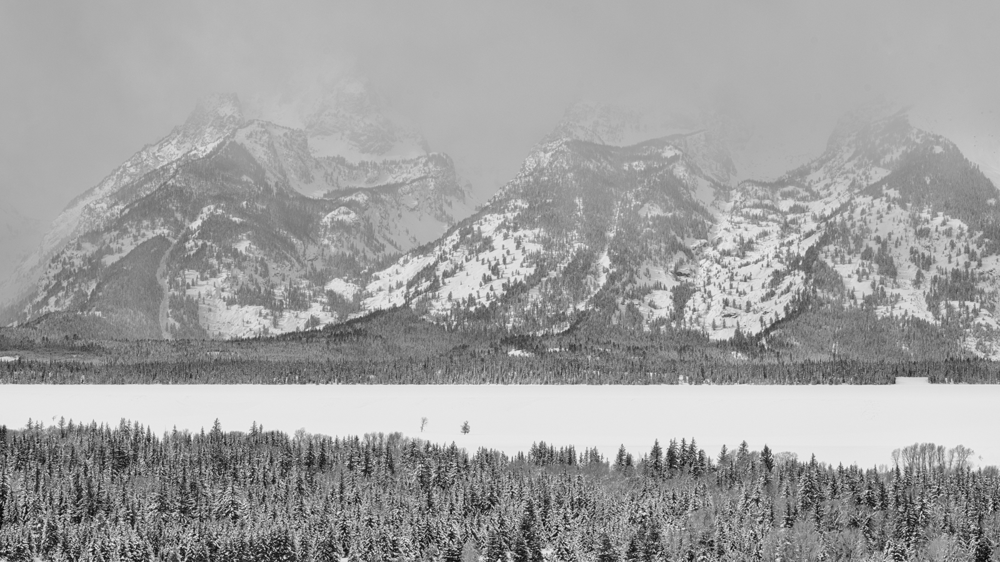
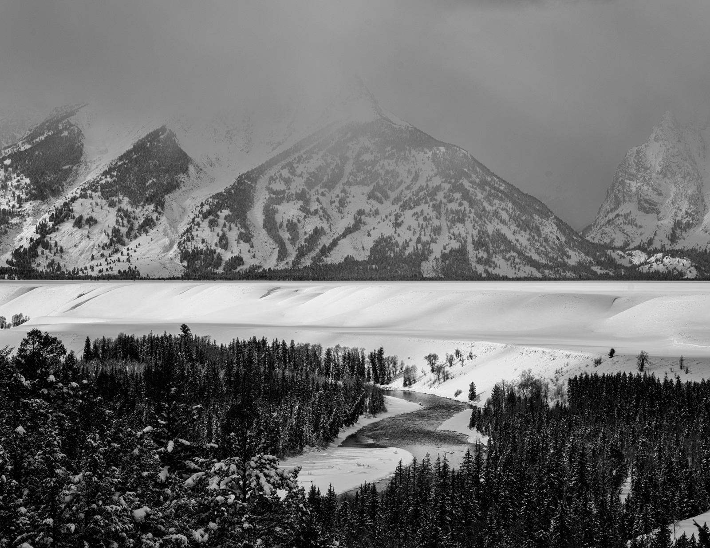
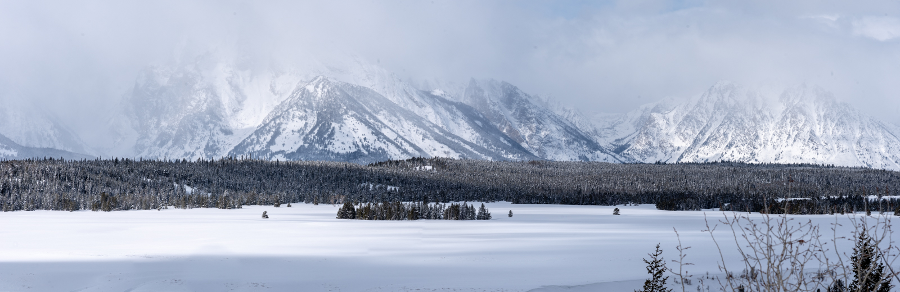
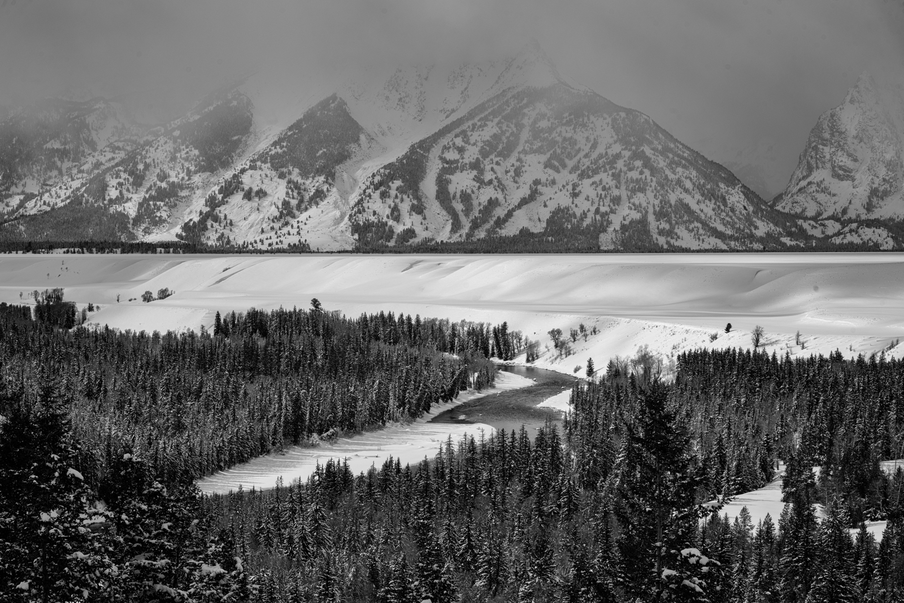
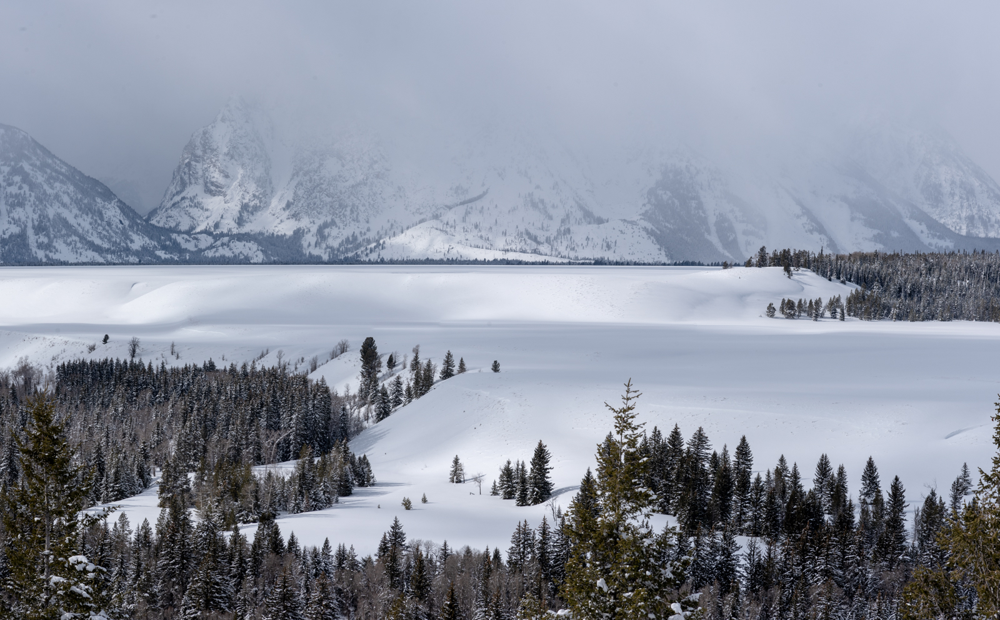

### Introduction

I had a great opportunity to make a solo trip to Jackson Hole, Wyoming for a skiing trip, prior to meeting my family in Steamboat, CO.  Given how quickly I knew I could tire myself out resort riding solo, I brought my camera and spent a lot of early mornings and evenings doing winter photography in the area.

### Saturday: Arrival & Scouting

I arrived at Jackson Hole airport around midday, and after losing my luggage at the worlds smallest airport, picked up the rental car and started exploring.  Driving north into Grand Teton National Park, I scoped out Glacier View, Snake River View, and a couple other famous turnouts from the road.

February 2019 set multiple snow records for Jackson, and the getting out of the car at the pulloffs required a climb up a four to six foot wall of snow and ice.  The clouds were also low, only exposing the first 800-1000 feet of the Teton mountain range, but gentle enough to provide some great soft light on the rolling hills, cliffs, and misty trees over the Snake River.  

In addition to the pull-offs, I drove far enough to see a heard of bison at ranch gate. This was the first time I'd seen bison.  They are huge and were close enough that I didn't want to park too close, and definitely didn't get out of the car.

I made a few attempts at walking off the road, but it was clearly snow-shoe conditions, and I sunk in the snow up to my waist everytime I attempted to get off the road.  I thought about finding a pair of snow-shoes this trip, but the days were short and busy, and I didn't end up picking up a pair.  I definitely recommend bringing some for winter-photography here.

Later that evening, I went back and out explored the Gros-Ventre road.  A bit east of highway 192, and further from the mountains, this was is a location for wildlife and simple, clean landscape shots.  I wasn't quite feeling my groove that first evening, but did spot a few places to explore in the future, and spotted two coyotes (I thought they were wolves at first).  The small town of Kelly (Wikipedia link for Kelly?) really surprised me most of all.

I drove home in the dark, needing to get unpacked and get ready for a long first day of photography and riding.

 
 
 
 
 
 
 
 

### Sunday: Photography and Riding

#### Sunrise Attempt #1

Waking up at 5am and planning for a sunrise at 6.15, I had coffee and got dressed.  I drove from my Jackson hotel up to the Glacier overlook.  I got there in the dark before sunrise, channeling every famous landscape photographer, but it was obvious the mountains were fully shrouded in clouds and fog and weren't going to be exposed that first morning.  With the temps hovering around -20F / -29C, I mostly sat in the car with the heat cranked.

Leaving the road that flanks the Teton Range, I headed back up Gros Ventre road, looking for some scenery, and caught a bit of color as the sun lit an eastern hill, and a few solo trees.  I recognized I needed to rent a longer lens so I could isolate further subjects as well as wildlife, and added that to my list for later that day.

#### First Day of Riding

After breakfast in the hotel, I caught the city bus to Teton Village, then froze while grabbing my lift ticket and waiting for the Jackson Hole tram.  I had a great day, mostly exploring the southern side of the park. I found some leftover powder from the previous weeks dump in the trees, and quickly grabbed 5 laps there before a morning break.

During my first trip to Jackson, there was very little snow on the mountain. I was looking forward to exploring with deep snow, and it was fantastic.  In the early afternoon I did the short hike up the headwall, and was rewarded with a quick powder run through a bowl.

<< Insert Slopes Map >>

I grabbed a light lunch, cruised some groomers, then was ready to head home and grab a nap.  It was an early start and a long day.

#### Sunset

After grabbing a late afternoon nap, I rushed to the cool Jackson Camera store, met @isaacsphotos (( Instagram Link )) and rented a long lens.  It was a Niken F5-6.3 150-600mm.  It was huge, and I see why they call it a bazooka lens.

I headed back up Gros Ventre road, and knocked out a few trial shots at a maximum distance to see what this thing could do.  The peaks started to show themselves as well, which really added to the excitement.  The Teton range is truely beautiful.  

While I heard reports of big horn sheep, moose, etc... I didn't spot any that evening.  It really would have been fantastic to see last nights coyotes with the reach of the rented long lens.  The warm spring past Kelly however, really provided an epic mist with geese and others landing in the fog.  While there, I met a couple other photographers enjoying the clear view of the mountains and the color that evening.

After helping a snowmobile crew fix their trailer, I turned around and caught a wonderful sunset over the peaks with a farmhouse and lake in the foreground.

 
 
 
 
 
 

### Monday: Snake River

#### Sunrise Attempt #2

Another early start, driving up to Grand Teton National Park.  This time, I wanted the shots from the iconic Snake River overlook.  At first, my access to the overlook was blocked by bison and some protective park rangers!  After some creative driving, I got into the overlook, and setup my tripod and aimed  at the mountains as blue light started to open up the Teton range.

 The alpen-glow on the peaks, and the entire scene encompassing the river, trees and hills was incredible.  I bounced between different focal lengths and compositions, playing with different elements to see what I thought came together best.  Without clouds, a long exposure didn't seem to make sense, but instead I tried to capture the mist in the trees and the reflection on the river.  

After a successful sunrise, it was time for a great day on the slopes.  I again found my best run after a headwall hike, this time walking past rendezvous bowl, and heading to the Casper Chutes - which turned out to be very accessible.  While the slopes weren't fresh powder soft, the conditions were still very steep, and I found plenty of fun run.

#### Evening Day 2

I left the slopes a bit early, as I was pretty drained from the early starts the past few days.  After a nap, it was back out on the road exploring with the camera.  As it was my last chance with the long lens, I was committed to finding moose.

And I did!  Nothing epic, but moose were in the trees, in the bushes, and by the river.  This was up the same road (Gros Ventre) that I had explored the previous evening.  Sunset was also a bit of a non-event after the mornings firework's.  I attempted some full moon photography once the sun was fully down, taking advantage of the excellent high ISO capabilities of the D750.

 
 
 
 

### Tuesday: Skiing and Hoback Canyon

#### Skiing

I skipped sunrise - I wanted a full day of skiing, and the early starts had taken it out of me.  I also needed to make a rental car switch for logistical purposes.

The skiing was again great.  Before lunch, I did a different chute from the headwall, and rode all the way from top to bottom.  As I approached the base area, two moose emerged from the trees, and accompanied us down the trail.  Also, as a final hurrah after lunch, I found more fresh snow on the far north side of the mountain that I had not explored over the past few days.

#### Evening Photos

I headed off in a different direction, scouting out highway 191, along the Hoback River.  This was the road that I'd be driving out the following morning to Steamboat.  There were a number of pullouts, but they were plowed in and it was impossible to pull off the road.  I reached a snowmobile track, and tried to take some shots of a frozen river or a dramatic sunset, but didn't find anything.  Another evening on Gros Ventre Road or further north would probably have been the better move.

### Wednesday: Departure and Conclusion

On Wednesday morning, I awoke before sunrise to get to Steamboat in time to meet my family when they arrived at the airport.  It was a long, easy drive through some huge winds and blowing snow, but no problems along the way.

The trip was fantastic, and a great blend of photography and snowboarding.  Snowboarding is more fun with a partner, but the freedom to explore the area with my camera was great and the memory that sticks with me a few years later.

